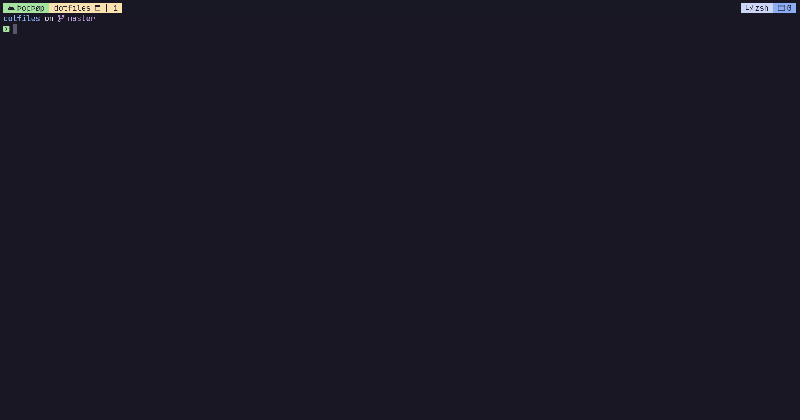

# Dotfiles
Welcome to my dotfiles repository! This project houses my personal configurations for Neovim, Tmux, and various other applications I use daily. The primary goal of this repository is to streamline my development environment setup across different machines and share my workflow optimizations with the community.

